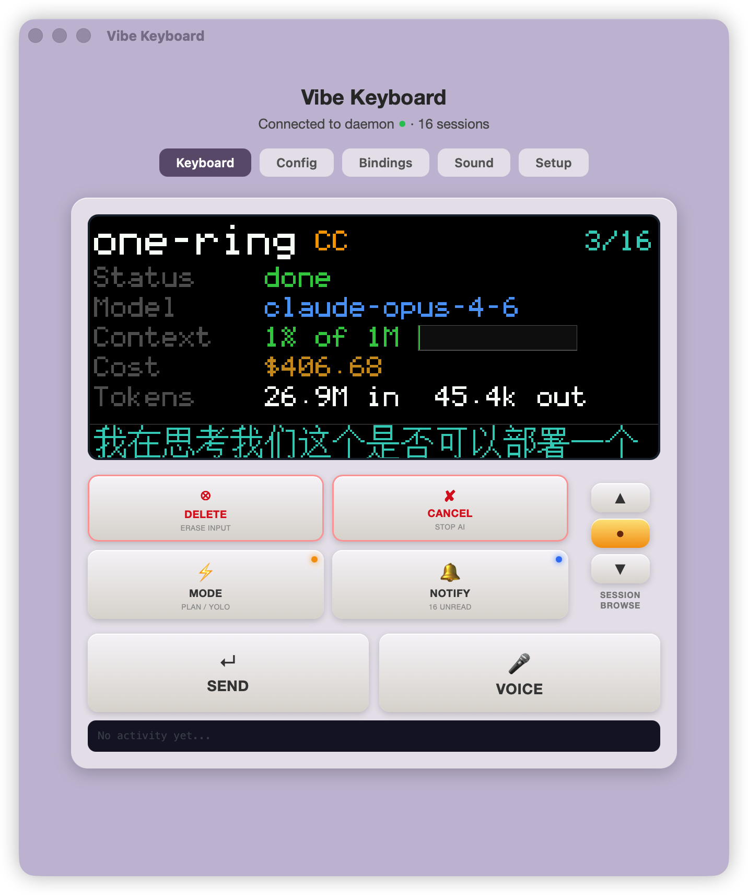
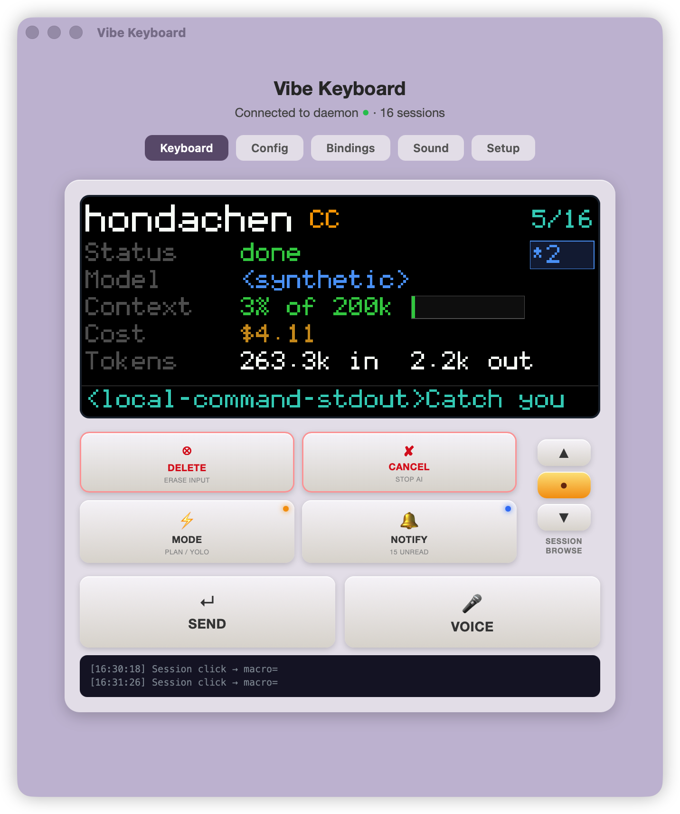
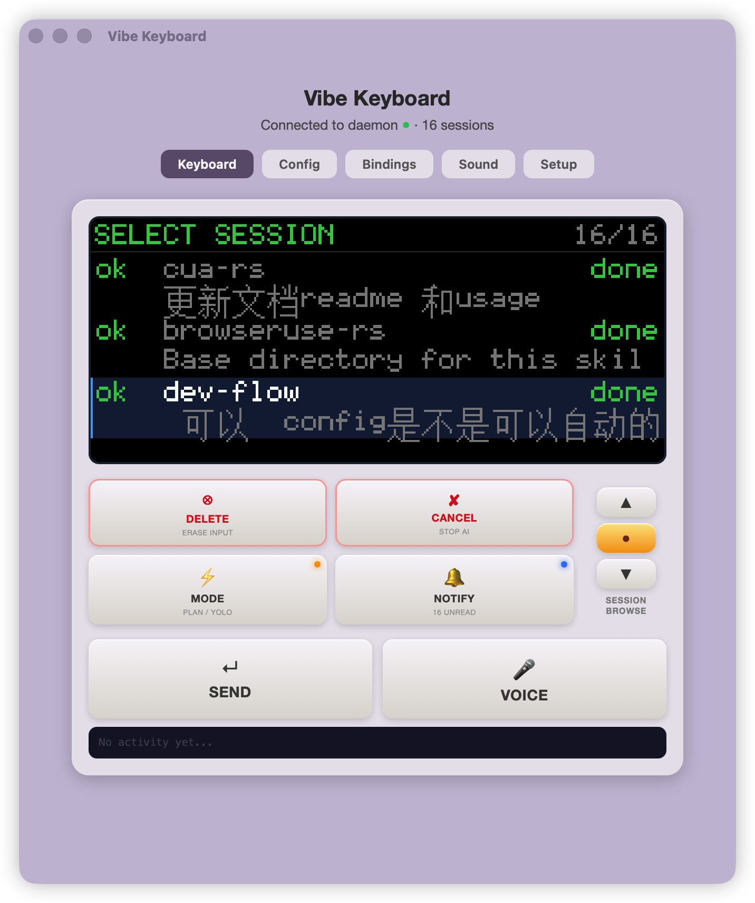
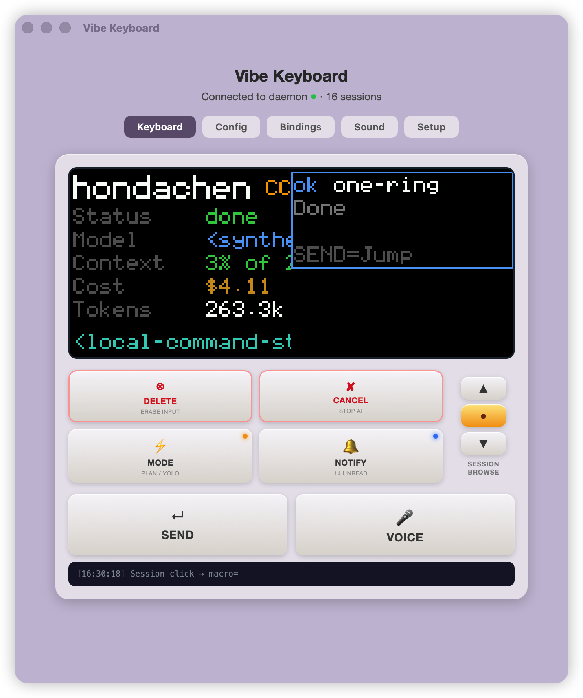
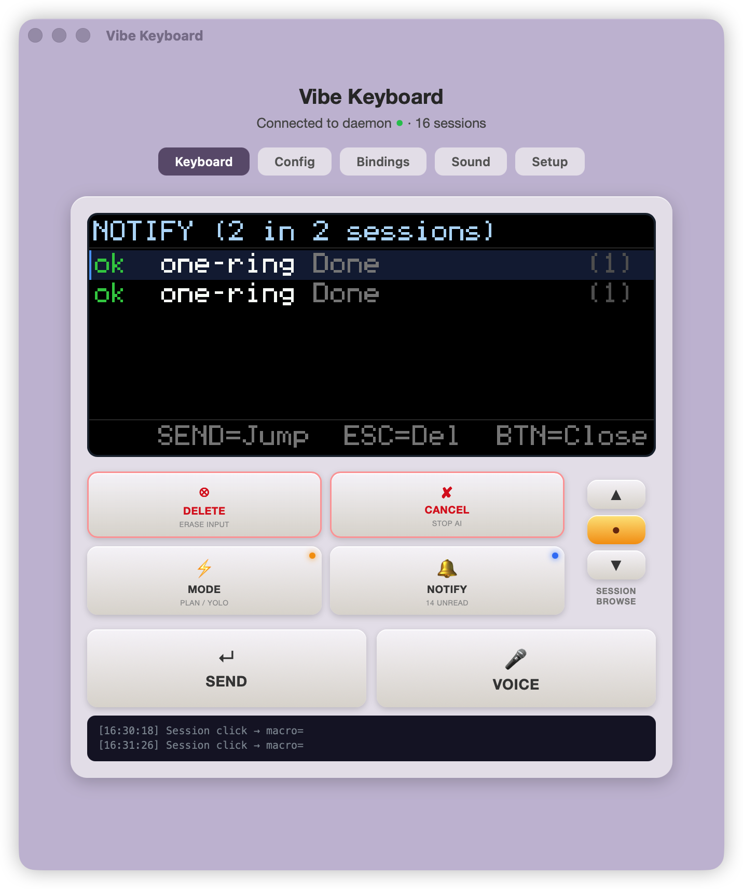

# Vibe Keyboard — 产品设计简报 (Design Brief)

> 版本 1.0 | 2026-04-07

---

## 1. 一句话说清楚

**Vibe Keyboard 是给 AI agent 用户的物理控制中心。**

你同时跑着 Claude Code、Cursor、Codex 等多个 AI agent——写代码、写文档、跑测试。它们各自在不同窗口里工作，随时可能需要你审批权限、查看状态、切换焦点。

我们做的事：**一个旋钮 + 按钮 + LCD 的物理设备，让你不用离开当前工作，就能管理所有 AI agent session。**

---

## 2. 我们解决什么问题

### 痛点场景

想象你同时开着 5 个 AI agent session——两个 Claude Code 在写代码，一个 Cursor 在做重构，一个在用 AI 写 PRD，还有一个在跑自动化测试。突然，其中一个 session 需要权限审批（"我要删除这个文件，可以吗？"）。

**现在他要做的事**：
1. 收到一个通知（如果装了 peon-ping）
2. 在 5 个终端 tab 里逐个找——哪个在等我？（3-10 秒）
3. 找到了，切过去，看请求内容
4. 决定允许或拒绝
5. 切回去继续原来的工作——但注意力已经被打断了

**用了 Vibe Keyboard 之后**：
1. 设备响一声 + LCD 显示权限请求内容
2. 按一下 SEND（允许）或 CANCEL（拒绝）
3. 桌面自动跳到对应窗口——完成

**核心价值：从"找"变成"看一眼"，从"点击"变成"按一下"。**

### 为什么是硬件不是软件

市面上已经有软件方案（agent-deck 1.8K 星、peon-ping 4.2K 星），但它们有天花板：
- **软件通知容易被忽略**——淹没在其他通知里
- **没有常驻状态显示**——你不知道其他 session 在干嘛
- **操作还是鼠标/键盘**——还是要切窗口

物理设备的旋钮 + LCD 是**不可被软件替代的交互模式**：
- 眼角余光就能看到所有 session 状态
- 旋钮是天然的"列表浏览"隐喻
- 按钮按下去有确定感——"允许"就是允许，不用找确认对话框

---

## 3. 目标用户

### 我们的用户

**"AI Power User"**——日常深度使用 AI agent 工具的人

不只是写代码的开发者——还包括用 Claude Code 写 PRD 的产品经理、用 Cursor 做设计稿的设计师、用 AI agent 优化工作流的各类专业人士。共同点是：

- 同时跑 **3 个以上 AI agent session**（多项目并行、多工具并行）
- AI 工具是日常工作的**核心生产力**，不是偶尔用用
- 追求"心流"——被权限弹窗、窗口切换打断是最大痛点
- 年花在生产力工具/外设上 $300-800，72% 愿意自费购买

### 不是我们的用户

- 完全不用 AI agent 的人
- 只用 AI 做简单问答、不跑多 session 的轻度用户

---

## 4. 产品长什么样

### 硬件

```
┌──────────┬──────────┬──────────────┐
│ DELETE ⊗ │ CANCEL ✘ │              │
│ 清除命令  │ 停止/拒绝 │    旋钮       │
├──────────┼──────────┤  转: 切换session│
│ MODE ⚡  │ NOTIFY 🔔│  短按: 审批/跳转│
│ PLAN/YOLO│ 通知中心  │  长按: 打开列表 │
├──────────┴──────────┴──────────────┤
│    SEND ↵       │     VOICE 🎤     │
│  允许/发送/确认  │  语音(预留)/宏   │
└─────────────────┴──────────────────┘
         ┌──────────────────┐
         │   LCD 小屏幕      │
         │  800×340 像素     │
         │  显示 session 状态 │
         └──────────────────┘
```

**6 个按钮 + 1 个旋钮 + 1 个 LCD + 1 个小扬声器**，USB-C 连电脑。

按钮分三类：
- **固定功能**: SEND（发送/允许）、CANCEL（停止/拒绝）、MODE（PLAN↔YOLO 切换）、NOTIFY（打开通知中心）
- **可自定义宏**: DELETE（默认 Ctrl+U 清除行）、VOICE（默认 Fn，可绑任意按键）
- **旋钮**: 转动切换 session / 短按处理权限或跳转窗口 / 长按打开列表

### 五个屏幕状态

| 屏幕 | 什么时候出现 | 显示什么 |
|------|-------------|---------|
| **待机** | 没有 AI session 运行 | Logo + 时间 |
| **详情** | 正常工作中 | 当前 session：名称、模型、花了多少钱、状态 |
| **列表** | 长按旋钮 | 所有 session 列表，转动选择，按下确认跳转 |
| **审批** | AI 请求权限 | "要写 main.rs，允许吗？" + Allow/Deny/Always |
| **通知** | 按 NOTIFY 键 | 未读通知列表（哪些完成了、哪些出错了） |

**详情屏** — 日常最常看到的画面。显示当前 session 的名称、模型、token 用量、费用、上下文占比，底部是 AI 最后一条输出。右上角 `3/16` 表示"当前是第 3 个 session，共 16 个"——直接转旋钮就能在 session 间快速切换，数字会跟着变。



有新通知时，右上角会出现蓝色角标（如 `*2`），提示有未读通知等待查看：



---

## 5. 产品怎么运作（概念图）

```
  ┌─────────────────────┐
  │   你的 AI 工具       │
  │  Claude Code         │
  │  Cursor              │    "我要写 main.rs"
  │  Codex               │ ──────────────────┐
  └─────────────────────┘                    │
                                             ▼
  ┌─────────────────────────────────────────────┐
  │           Vibe Daemon (后台服务)              │
  │                                             │
  │  监听所有 AI session 的状态变化               │
  │  收集 token 用量、费用、模型信息              │
  │  管理权限请求队列                            │
  │  当你按按钮时，帮你跳到对应窗口               │
  └──────────────┬──────────────────────────────┘
                 │
                 │ 实时同步
                 ▼
  ┌─────────────────────────────────────────────┐
  │          Vibe Keyboard (物理设备)             │
  │                                             │
  │  LCD 显示当前状态                             │
  │  旋钮浏览 session 列表                        │
  │  按钮发送审批决定                             │
  │  扬声器播放提示音                             │
  │                                             │
  └─────────────────────────────────────────────┘
```

**核心思路：AI 工具 → 后台服务（翻译+路由）→ 物理设备（显示+操作）**

用户不需要知道后台服务存在——插上 USB，打开一次应用，之后全程用设备操作。

---

## 6. 核心用户流程

### 流程 1：权限审批（最高频场景）

```
AI 请求权限（"要执行 rm -rf temp/"）
        │
        ▼
设备响提示音 🔔 + Normal 屏显示权限详情
（不抢占屏幕，旋钮切 session 不受影响）
        │
        ├─── 按 SEND ──► 快速允许（1 秒完成）
        │
        ├─── 按 CANCEL ──► 快速拒绝
        │
        ├─── 短按旋钮 ──► 进入完整审批屏
        │        └─── 旋钮选 "Always" + 按 SEND ──► 永久允许
        │
        └─── 不想处理？直接转旋钮切到其他 session，权限留在队列
```

**设计逻辑**：90%+ 的权限请求都是 Allow——SEND 一按完事。Deny 用 CANCEL。只有需要 "Always"（永久允许）时才短按旋钮进审批屏，多一步操作防误触。

**不和旋钮切换冲突**：旋钮转动始终是切 session，权限审批通过 SEND/CANCEL 按钮完成——两者互不干扰。用户可以转旋钮先去处理其他 session，回来再审批，权限不会丢失。

### 流程 2：多 Session 切换

旋钮有两种切换方式：

**快速切换（直接转旋钮）**：
```
正在看 Session A 的详情
        │
        ▼
直接转旋钮 → 立即切到下一个/上一个 session
        │
LCD 刷新为新 session 的详情，桌面自动跳转到对应窗口
```

知道自己要切哪个 session 的时候，转一下就到了——不用进列表、不用确认。

**精确选择（长按旋钮进列表）**：
```
长按旋钮 → LCD 展开所有 session 列表
        │
看到 Session C 标着 "⚠ 等待审批"
        │
        ▼
转到 Session C → 按旋钮确认
        │
        ▼
桌面自动跳转到 Session C 的终端窗口
```

session 多的时候，长按旋钮打开完整列表，看清楚每个 session 的状态再选。3 秒不操作自动收回。

**短按旋钮**：如果当前 session 有权限请求 → 进入完整审批屏（可选 Always）；如果没有 → 跳转到当前 session 的桌面窗口。



### 流程 3：通知中心

```
你在专心写代码，有新通知到达
        │
        ▼
这时详情屏右上角出现 Toast 弹窗，提示哪个 session 有新事件：
```



```
按 NOTIFY 按钮 → LCD 切到通知中心，看到完整列表：
```



```
转旋钮选中目标 session → 按 SEND 或旋钮确认
        │
        ▼
桌面自动跳到该 session 的终端窗口，通知标记已读
```

**设计逻辑**：通知分两层——**Toast 弹窗**是被动提醒（在详情屏右侧弹出 5 秒自动消失），**通知中心**是主动查看（按 NOTIFY 打开完整列表）。按 CANCEL 可以删除通知，SEND/旋钮按下跳转到对应 session。3 秒无操作自动返回详情屏。

---

## 7. 桌面端配置

设备配套一个 Tauri 桌面应用（macOS），提供 5 个配置 Tab：

| Tab | 功能 |
|-----|------|
| **Keyboard** | LCD 镜像显示 + 虚拟按钮（没有硬件时也能操作） |
| **Config** | 显示和按键配置 |
| **Bindings** | 自定义按键宏绑定（DELETE 和 VOICE 可自由映射） |
| **Sound** | 音量/静音控制 + 4 种事件提示音映射 + 上传自定义 WAV 音效 |
| **Setup** | 一键安装/卸载 AI 工具的 Hook |

**音效自定义**：每种通知事件（权限请求、完成、错误、按键点击）都可以单独设置提示音——内置 4 个默认音效，也可以上传自己的 WAV 文件。音量和静音独立控制。

---

## 8. 事件系统与集成

### AI 工具如何和 Vibe Keyboard 通信

AI 工具（Claude Code、Cursor、Codex 等）通过 HTTP 向 Vibe Keyboard 的后台服务发送事件。后台服务监听在 `127.0.0.1:19280`，接收 JSON 格式的 Hook 事件。

```
AI 工具 ──POST /event──► Vibe Daemon ──IPC──► 物理设备/模拟器
                              │
                         处理事件：
                         • 更新 session 状态
                         • 触发通知和提示音
                         • 阻塞等待权限审批
```

### 支持的事件类型

| 事件 | 含义 | 设备反应 |
|------|------|----------|
| **SessionStart** | 新的 AI session 开始 | LCD 显示新 session |
| **SessionEnd** | AI session 结束 | 从列表移除 |
| **UserPromptSubmit** | 用户发送了 prompt | 状态→"思考中" |
| **PreToolUse** | AI 准备调用工具 | 状态→"工具使用" |
| **PostToolUse** | AI 工具调用完成 | 状态→"写入中" |
| **Stop** | Session 停止 | 状态→"完成" + 提示音 🔔 |
| **permission** | AI 请求权限审批 | LCD 切到审批屏 + 提示音 ⚠️ |

### 通知触发规则

不是所有状态变化都会打扰用户——只有这 4 种事件会产生通知和提示音：

| 事件 | 提示音 | 通知优先级 | 例子 |
|------|--------|-----------|------|
| **权限请求** | 警报 (880Hz) | 最高 | "Write main.rs" |
| **错误** | 低沉警报 (220Hz) | 高 | "build failed" |
| **完成** | 清脆提示 (1047Hz) | 中 | "task complete" |
| **Context >90%** | 低沉警报 (220Hz) | 低 | "Context 95%" |

日常的"思考中""工具使用""写入中"等高频状态变化是**静默**的——只更新 LCD 显示，不发通知，不响提示音。

### 权限审批机制

权限审批是 Vibe Keyboard 的核心能力之一。当 AI 要执行敏感操作时：

1. **AI 工具发送权限请求** → HTTP 请求被**阻塞**（最长 5 分钟）
2. **设备显示审批屏** → 用户看到"AI 要做什么"
3. **用户按按钮决定**：
   - SEND = 允许（这一次）
   - CANCEL = 拒绝
   - 旋钮选 Always + SEND = 永久允许这类操作
4. **结果返回给 AI 工具** → AI 继续或停止

**安全设计**：5 分钟无操作默认**拒绝**（不是允许）。这是 fail-closed 设计。

另外支持 **YOLO 模式**：通过规则自动审批低风险操作（如读取文件），高风险操作（如 `rm -rf`、`git push`）始终需要人工确认。

### 集成状态与支持工具

| AI 工具 | 状态 | 集成方式 |
|---------|------|----------|
| **Claude Code** | ✅ 已实现 | 原生 Hook (HTTP POST) |
| **Codex CLI** | ⏳ 计划中 | Hook event mapping |
| **Cursor** | ⏳ 计划中 | 文件系统监控 / SQLite 轮询 |
| **Gemini CLI** | ⏳ 计划中 | Hook adapter |
| **OpenCode** | ⏳ 计划中 | TypeScript plugin |
| **Windsurf** | ⏳ 计划中 | Hook adapter |
| **GitHub Copilot** | ⏳ 计划中 | Hook adapter |
| **Amp** (Sourcegraph) | ⏳ 计划中 | 文件系统监控 |
| **Kiro** | ⏳ 计划中 | Hook adapter |
| **VS Code + AI 扩展** | ⏳ 计划中 | Extension API |
| **Rovo Dev CLI** | ⏳ 计划中 | Hook adapter |
| **Kimi Code** | ⏳ 计划中 | Hook adapter |

目标是覆盖主流 AI agent 工具的全生态。接入协议已经稳定——新工具只需要向 `POST /event` 发送标准 JSON 事件，核心工作是**适配各工具的 Hook/回调机制**。

### 硬件平台规划

当前使用桌面模拟器验证所有交互逻辑。未来硬件目标平台为 **Linux SBC**（单板计算机）：

| 组件 | 模拟器 (当前) | Linux 硬件 (计划) |
|------|--------------|------------------|
| 按钮 | 键盘按键模拟 | GPIO 物理按钮 |
| 旋钮 | 方向键模拟 | EC11 旋转编码器 |
| LCD | 终端字符渲染 | MIPI DSI LCD |
| 音频 | 桌面音频播放 | ALSA |
| 传输 | Unix socket IPC | USB / 直接进程通信 |

架构上，传输层是可插拔的（Transport trait）——切换硬件后端不需要改动 UI、协议、业务逻辑代码。模拟器验证过的交互逻辑可以**原封不动**地运行在真实硬件上。

---

## 9. 已知局限与待解决问题

| 问题 | 现状 | 影响 |
|------|------|------|
| **窗口跳转精度** | iTerm2 可精确跳到 tab/session（通过 TTY 匹配）；其他终端只能跳到应用级别，无法定位到具体 tab | 多 tab 用户需要手动找 tab |
| **终端测试覆盖** | 窗口跳转只在 iTerm2 上做过真实测试；Ghostty/Warp/VSCode 策略已写但未充分验证 | 非 iTerm2 用户可能遇到跳转问题 |
| **IDE 集成深度** | VS Code/Cursor 等 IDE 内嵌终端的 tab 跳转需要研究 Extension API，当前只能跳到 IDE 窗口 | IDE 用户体验打折 |
| **仅 macOS** | 窗口跳转（CGEvent）、按键注入、桌面通知均依赖 macOS API | Linux/Windows 用户暂不可用 |
| **仅 Claude Code** | 当前只完成了 Claude Code 的 Hook 集成 | 其他 AI 工具用户需等待 M13 |
| **权限阻塞超时** | HTTP 阻塞 5 分钟后超时 deny，如果用户离开太久会影响 AI 工作流 | 长时间离开时 AI 会被卡住 |

这些是已知的、计划解决的问题，不是设计缺陷。核心交互逻辑（旋钮/按钮/LCD 状态机）已经验证可靠，上述问题主要是**平台适配的广度和深度**。

---

> 基于代码库 (8 Rust crates, 17K LOC) + 产品文档 (30+ 文件) + 市场研究 (6 份报告) + 测试数据 (333 tests) 自动生成